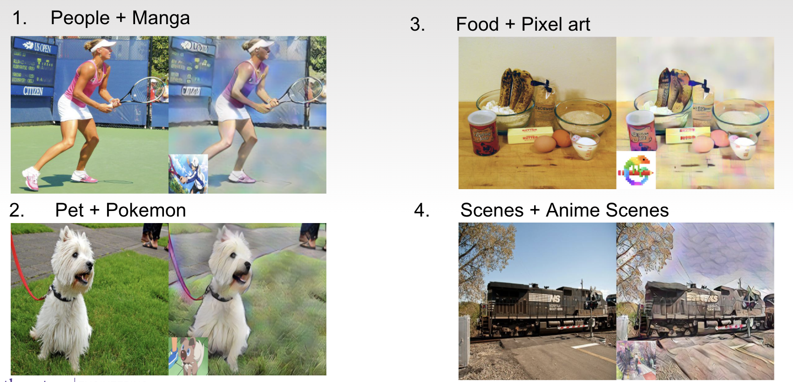
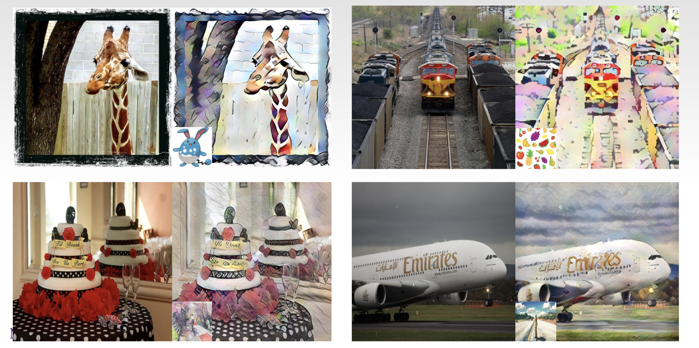
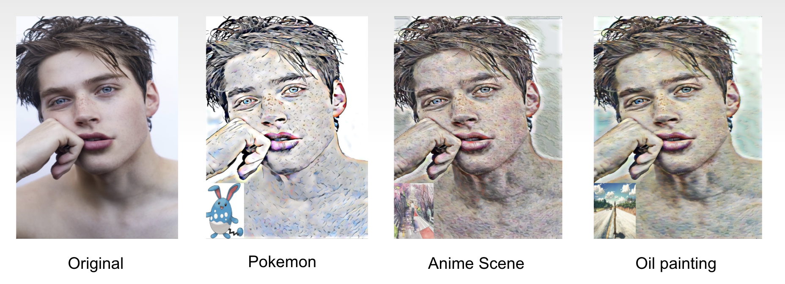
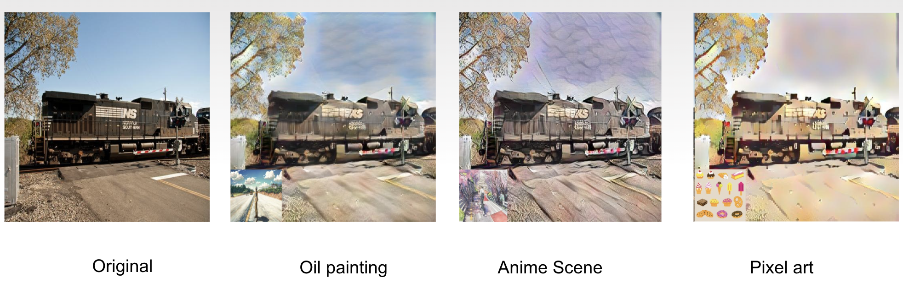

# Profile Picture Style Transfer
#### Authors: [Tianchang](https://github.com/LTCrazy), [Hualiang](https://github.com/ryanqin), [Xingbang](https://github.com/liux2)

[](https://opensource.org/licenses/MIT)
[](https://www.python.org/)
[](https://pytorch.org/)

## Table of Contents

- [What's This Project About?](#what-s-this-project-about)
  * [Dataset](#dataset)
- [Dependencies](#dependencies)
- [How to Run?](#how-to-run)
- [Findings](#findings)
- [License](#license)

## What's This Project About?

Ever wanted to make your profile picture stylish? Ever wanted to make a stylish
profile picture that can be chained on NFTs? neural style transfer algorithms
takes your profile picture, based on the content in the picture, relative styles
will be transferred onto your profile picture.

The original work is from [Pytorch_Adain_from_scratch](https://github.com/irasin/Pytorch_AdaIN).
We used the author's code to train and test on our selected styles. [@irasin](https://github.com/irasin)
built the adaptive instance normalization neural style transfer based on
[Arbitrary Style Transfer in Real-time with Adaptive Instance Normalization](http://openaccess.thecvf.com/content_ICCV_2017/papers/Huang_Arbitrary_Style_Transfer_ICCV_2017_paper.pdf).

### Dataset

**Training dataset**

|             |      **Dataset**      |                                     **Link**                                     |
|-------------|:---------------------:|:--------------------------------------------------------------------------------:|
| **Content** |          Coco         |       https://www.kaggle.com/shaorrran/coco-wikiart-nst-dataset-512-100000       |
| **Style**   |        Wikiart        |       https://www.kaggle.com/shaorrran/coco-wikiart-nst-dataset-512-100000       |
|             |        Pokemon        |              https://www.kaggle.com/kvpratama/pokemon-images-dataset             |
|             |       Pixel-art       |                    https://www.kaggle.com/riamishra/pixel-art                    |
|             |         Manga         |     https://www.kaggle.com/kanakmittal/anime-and-cartoon-image-classification    |
|             | Japanese anime scenes | https://www.kaggle.com/weiwangk/japanese-anime-scenes                            |
|             |       Portraits       | https://www.kaggle.com/ipythonx/wikiart-gangogh-creating-art-gan?select=portrait |

## Dependencies

1. PyTorch
 Based on your machine hardware, you can choose to use [Nvidia NGC containers](https://catalog.ngc.nvidia.com/orgs/nvidia/containers/pytorch),
 or install by using the [official scripts](https://pytorch.org/get-started/locally/).

2. scikit-image
 The official [install guide](https://scikit-image.org/docs/stable/install.html).

## How to Run?

The training and testing process are exactly as the original repository documented.

1. Training
 ```bash
 python train.py [-h]
                 [--batch_size BATCH_SIZE]
                 [--epoch EPOCH]
                 [--gpu GPU]
                 [--learning_rate LEARNING_RATE]
                 [--snapshot_interval SNAPSHOT_INTERVAL]
                 [--train_content_dir TRAIN_CONTENT_DIR]
                 [--train_style_dir TRAIN_STYLE_DIR]
                 [--test_content_dir TEST_CONTENT_DIR]
                 [--test_style_dir TEST_STYLE_DIR]
                 [--save_dir SAVE_DIR]
                 [--reuse REUSE]
 ```

2. Testing
 ```bash
 python test -c content_image_path -s style_image_path
            [-h]
            [--content CONTENT]
            [--style STYLE]
            [--output_name OUTPUT_NAME]
            [--alpha ALPHA]
            [--gpu GPU]
            [--model_state_path MODEL_STATE_PATH]
```

## Findings

We trained the model for 15 epochs on a AWS PyTorch instance. Our results shows that:

* Style with lots of white color might wipe out content color
* Style with lots of black color might smear content color
* Style with abundant colors might enrich content color
* Style with fewer textures might decrease the details of content
* Style with abundant textures might enrich the details of content

Some output images:






For a particular style image, we should adjust the Alpha to control the trade-off
between content and style. After a few round of testing, we found that:

* Results come out better with:
  * style and content images with strong strokes, outlines, textures, color contrast
* Results not good with:
  * anime scene style (lack of texture)
  * oil painting style (dark background)
  * people photo content with shadows or dark makeups (high color contrast on face can be oddly amplified)
  * lines and texts (twisted)

We recommend:

* Higher alpha for anime
* Lower alpha for oil painting

## License

This project is licensed under the MIT License - see the [LICENSE](LICENSE)
file for details.
